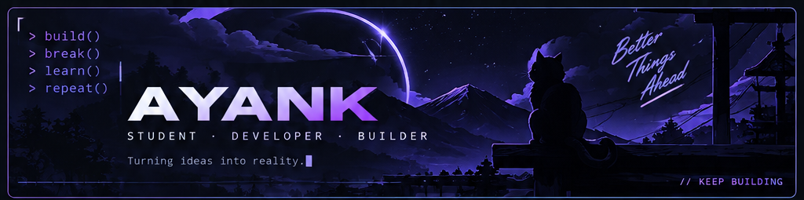
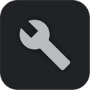
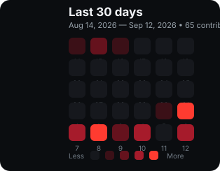

<div align="center">



<br>

<p>
  <a href="https://github.com/Ayank-ssh">
    
  </a>
  <a href="https://github.com/Ayank-ssh?tab=followers">
    
  </a>
  <a href="https://github.com/Ayank-ssh">
    
  </a>
</p>

</div>

---

##  About Me

I'm **Ayank**, a student and developer who likes turning ideas into working software.

I spend most of my time around **backend development, automation, Discord bots, Linux, infrastructure, and security-focused projects**. I enjoy the full cycle — building something, breaking it, understanding why, and making it better.

```text
> build()
> break()
> learn()
> repeat()
```

---

##  Currently Building

### [Supernova Security](https://github.com/Ayank-ssh/Supernova-Security)

A security-focused project centered around **automation, protection, moderation, and reliability**.

<p>
  
  
  
  
</p>

---

##  Tech Stack

<table>
<tr>
<td width="150"><b>Languages</b></td>
<td></td>
</tr>
<tr>
<td><b>Frontend</b></td>
<td></td>
</tr>
<tr>
<td><b>Backend</b></td>
<td></td>
</tr>
<tr>
<td><b>Tools & Infra</b></td>
<td></td>
</tr>
</table>

---

##  What I Build

<table>
<tr>
<td width="50%"> **Security systems**<br>Protection, moderation, anti-abuse and automation.</td>
<td width="50%"> **Discord bots**<br>Bots, utilities, automations and server tooling.</td>
</tr>
<tr>
<td> **Web apps**<br>Dashboards, APIs and useful interfaces.</td>
<td> **Infrastructure**<br>Linux, Docker, VPS, reverse proxies and self-hosting.</td>
</tr>
</table>

---

##  Connect

<p>
  <a href="https://instagram.com/kyros.ssh">
    
  </a>
  <a href="https://discord.gg/hff6f4fVPE">
    
  </a>
</p>

---

##  GitHub Activity

<p align="center">
  <a href="https://github.com/Ayank-ssh">
    
  </a>
</p>

<p align="center">
  <sub>Hover any cell for the date and contribution count. Click the graph to open GitHub's full interactive activity view.</sub>
</p>

<p align="center">
  <a href="https://github.com/Ayank-ssh">
    
  </a>
</p>

---

<div align="center">

 <b>Stay curious.</b> &nbsp; <code>&lt;/&gt;</code> &nbsp; <b>Keep building.</b> 

</div>
